# 🪙 KaChing
*Hear the savings. Split with purpose.* – A fee-optimized remittance router with auto-budgeting pockets for families, powered by **Stellar Soroban**.

## 🎬 Demo
<div align="center">
  <video src="media/demo.mp4" width="100%" controls></video>
  <p><i>If the video doesn't load, you can find it in the <code>/media</code> folder.</i></p>
</div>

## 🎯 Problem & Solution
**Problem:** Philippine remittances hit $35.63B in 2025, yet 43% of senders cite hidden fees as their top frustration. The PH Senate's OFW Remittance Protection Act warns that "such costs diminish OFW income" and mandates transparency. Families receiving irregular inflows struggle to allocate funds toward tuition, medical, and savings, causing cash leakage.

**Solution:** KaChing identifies the cheapest remittance route and offers two ways to send funds: **Direct Transfers** for traditional one-to-one payments, and **Managed Financial Pockets** for automated budgeting. Using a **Soroban Smart Contract** as a secure financial vault, it can split arriving funds into labeled budgets (e.g., Tuition, Savings) that are held by the contract, ensuring funds are used only for their intended purpose.

## ✨ Key Features
- **Smart Fee Routing**: Scans multiple Stellar Anchors to find the most cost-effective path.
- **Direct Transfers**: Seamlessly send any Stellar asset directly to a single recipient wallet.
- **Managed Financial Pockets**: Multi-recipient splits executed via a custom Soroban contract that acts as an escrow vault.
- **Budget Enforcement**: Ensures funds are used for their intended purpose by restricting withdrawals to the allocated pocket balance.
- **Blockchain History Sync**: Real-time transaction tracking directly from Stellar Horizon with full pagination support.
- **Freighter Integration**: Secure transaction signing using the official Stellar browser wallet.
- **Resilient Polling**: Robust transaction confirmation pipeline that bypasses SDK limitations for high reliability.
- **Premium UX**: High-fidelity glassmorphic interface with micro-animations and "Ka-Ching" audio feedback.

## 🛠️ Technical Stack
- **Smart Contract**: Rust & Soroban (v21+)
- **Frontend**: Next.js 14, Tailwind CSS, Framer Motion
- **Blockchain Interface**: `@stellar/stellar-sdk`, `@stellar/freighter-api`
- **Infrastructure**: Stellar Testnet, Horizon, Soroban RPC

## 🚀 Quick Start

### 1. Prerequisites

#### **For Smart Contract Development:**
- **Rust**: Version 1.70 or higher (`rustup update stable`)
- **WASM Target**: `rustup target add wasm32-unknown-unknown`
- **Soroban CLI**: Version 21.0.0 or higher (`cargo install --locked soroban-cli`)

#### **For Frontend Development:**
- **Node.js**: Version 18.0.0 or higher
- **NPM**: Version 9.0.0 or higher (comes with Node)
- **Stellar Freighter Wallet**: Installed as a browser extension and set to **Testnet**.

### 2. Setup

#### **Smart Contract Setup:**
```bash
# 1. Configure the Testnet network
soroban config network add --rpc-url https://soroban-testnet.stellar.org --network-passphrase "Test SDF Network ; September 2015" testnet

# 2. Generate a deployment identity
soroban config identity create dev

# 3. Fund the identity on Testnet
soroban config identity fund dev --network testnet

# 4. Build the contract
soroban contract build

# This will generate: target/wasm32-unknown-unknown/release/ka_ching.wasm
```

#### **Frontend Setup:**
```bash
# Install frontend dependencies
cd frontend
npm install

# Configure environment
# Create a .env.local file with:
NEXT_PUBLIC_STELLAR_NETWORK=testnet
NEXT_PUBLIC_RPC_URL=https://soroban-testnet.stellar.org
NEXT_PUBLIC_HORIZON_URL=https://horizon-testnet.stellar.org
NEXT_PUBLIC_CONTRACT_ID=YOUR_DEPLOYED_CONTRACT_ID
```

### 3. Run Development Server
```bash
# Ensure you are in the frontend directory
cd frontend
npm run dev
```

## 📜 Smart Contract Logic

### 🏗️ Architecture
The KaChing Smart Contract is built with Rust and optimized for the Soroban runtime. It acts as a trustless router for cross-border funds.

<div align="center">
  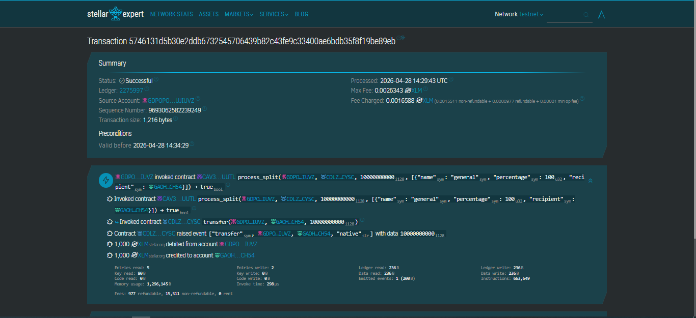
  <p><a href="https://stellar.expert/explorer/testnet/tx/5746131d5b30e2ddb6732545706439b82c43fe9c33400ae6bdb35f8f19be89eb" target="_blank">View Verified Execution on Stellar Expert</a></p>
</div>

### 🔄 Contract Function Flow
The core logic begins once the user initiates a **Direct Transaction** or **Pocket Split** from the frontend:

1. **Transaction Initialization**: The frontend builds a Soroban transaction containing the total amount, the asset type (XLM/USDC), and a vector of recipients (Pockets).
2. **Freighter Signing**: The user reviews and signs the transaction via the Freighter wallet, ensuring full custody and security.
3. **Soroban Invocation**: The signed XDR is submitted to the network, invoking the `process_split` function on the KaChing contract.
4. **Validation & Calculation**: 
   - The contract verifies that the sum of all pocket percentages equals exactly 100%.
   - It performs high-precision arithmetic to calculate the exact stroop/token amount for each budget.
   - **Escrow Allocation**: Instead of a final transfer, the contract updates an on-chain ledger, "locking" the funds into the recipient's virtual pockets for controlled spending.
5. **Atomic Execution**: The contract executes all ledger updates in a single atomic transaction. Either every recipient receives their allocated budget, or the entire transaction fails, preventing any "lost" money.

## 📜 Smart Contract Deployment
The KaChing core logic is handled by a Soroban smart contract. There are two ways to deploy it:

### 1. Automated Deployment (Development)
The project includes a custom auto-deployment system designed for rapid development.
- **Endpoint**: `POST /api/auto-deploy`
- **Logic**: When triggered, the server automatically recompiles the Rust contract, deploys it to the Testnet using the `dev` identity, and returns the new `Contract ID`.
- **Integration**: The frontend is configured to automatically trigger this if no persistent `NEXT_PUBLIC_CONTRACT_ID` is found in the environment.

### 2. Manual Deployment (Production)
For production or manual testing, use the following Soroban CLI commands:

#### Build the contract:
```bash
soroban contract build
```

#### Deploy to Testnet:
```bash
soroban contract deploy \
  --wasm target/wasm32-unknown-unknown/release/ka_ching.wasm \
  --source dev \
  --network testnet
```

#### Important Configuration:
After deployment, update your `.env.local` file with the generated Contract ID:
```env
NEXT_PUBLIC_CONTRACT_ID=CDRRTP... (your-new-id)
```

## 📸 Screenshots

### 🟢 Onboarding Flow
<div align="center">
  <table style="width:100%">
    <tr>
      <td width="33%">
        <p align="center"><b>Landing Page</b></p>
        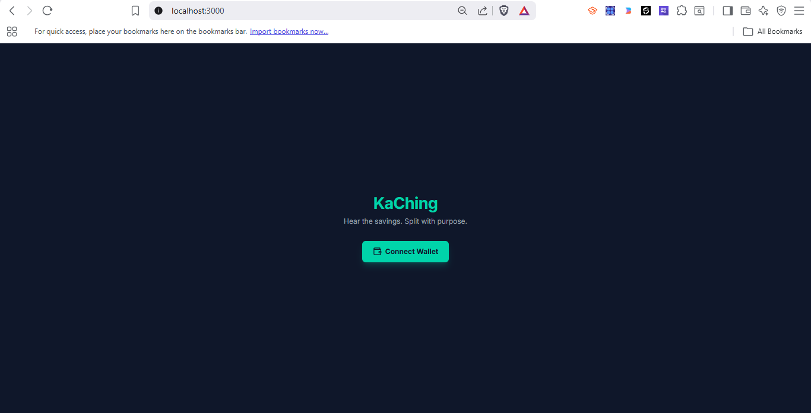
        <p align="center"><small>Entry point with "Connect Wallet" prompt.</small></p>
      </td>
      <td width="33%">
        <p align="center"><b>Freighter Approval</b></p>
        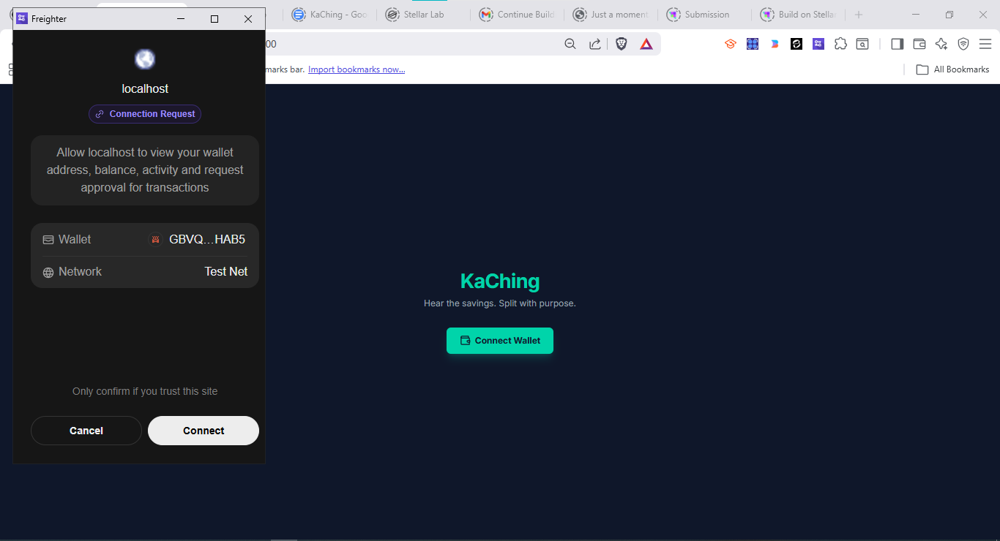
        <p align="center"><small>Secure wallet connection request.</small></p>
      </td>
      <td width="33%">
        <p align="center"><b>Main Dashboard</b></p>
        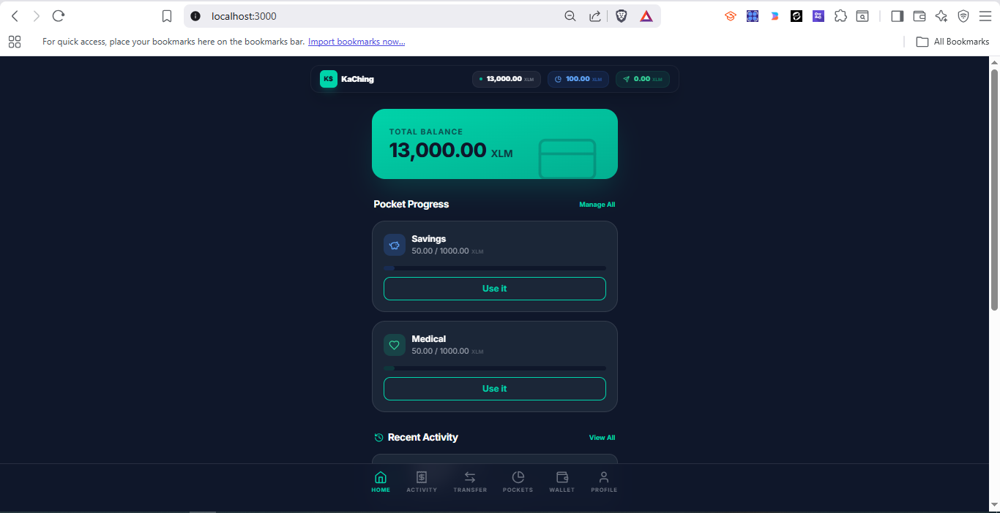
        <p align="center"><small>Live balances and pocket tracking.</small></p>
      </td>
    </tr>
  </table>
</div>

### 📱 Application Modules
<div align="center">
  <table style="width:100%">
    <tr>
      <td width="50%">
        <p align="center"><b>Main Dashboard</b></p>
        
        <p align="center"><small>Primary account overview showing total balance and recent pocket progress.</small></p>
      </td>
      <td width="50%">
        <p align="center"><b>Send Money (Transfer)</b></p>
        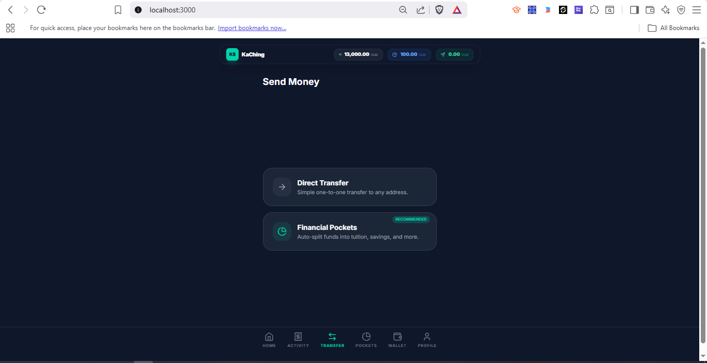
        <p align="center"><small>Central hub for selecting between Direct Transfers or Financial Pocket splits.</small></p>
      </td>
    </tr>
    <tr>
      <td width="50%">
        <p align="center"><b>Pockets Management</b></p>
        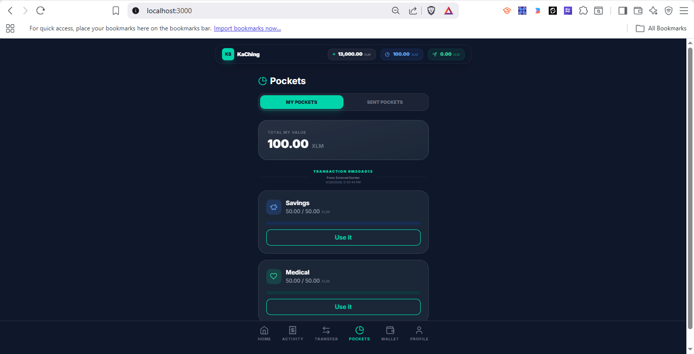
        <p align="center"><small>View and manage existing financial pockets and their allocation history.</small></p>
      </td>
      <td width="50%">
        <p align="center"><b>Activity Log</b></p>
        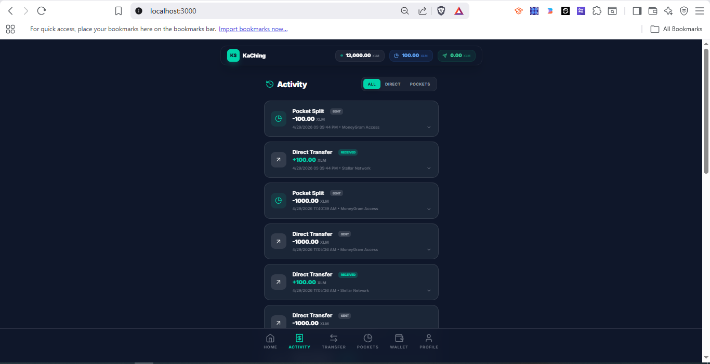
        <p align="center"><small>Comprehensive transaction history synced directly with the Stellar blockchain.</small></p>
      </td>
    </tr>
    <tr>
      <td width="50%">
        <p align="center"><b>Wallet View</b></p>
        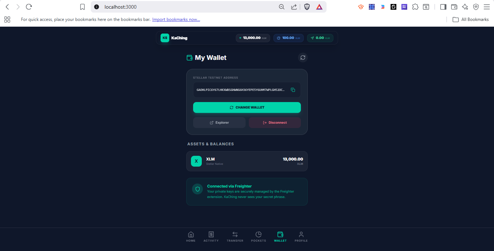
        <p align="center"><small>Detailed breakdown of all Stellar assets, balances, and trustlines.</small></p>
      </td>
      <td width="50%">
        <p align="center"><b>User Profile</b></p>
        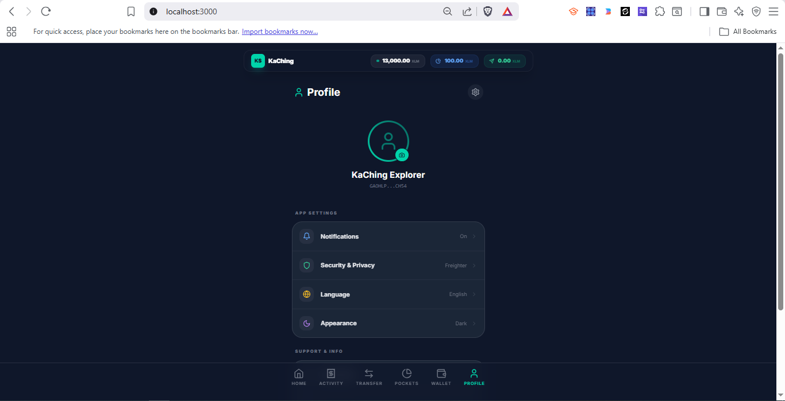
        <p align="center"><small>Manage account settings and view full Stellar public key details.</small></p>
      </td>
    </tr>
  </table>
</div>

## 🔄 Core Workflow: Direct Transaction

<div align="center">
  <table style="width:100%">
    <tr>
      <td width="33%">
        <p align="center"><b>1. Initiation</b></p>
        
        <p align="center"><small>User lands on the hub to select Direct Transfer.</small></p>
      </td>
      <td width="33%">
        <p align="center"><b>2. Transaction Details</b></p>
        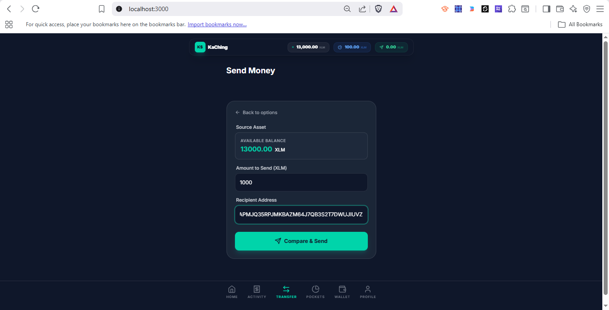
        <p align="center"><small>Entering asset type, amount, and recipient address.</small></p>
      </td>
      <td width="33%">
        <p align="center"><b>3. Smart Fee Routing</b></p>
        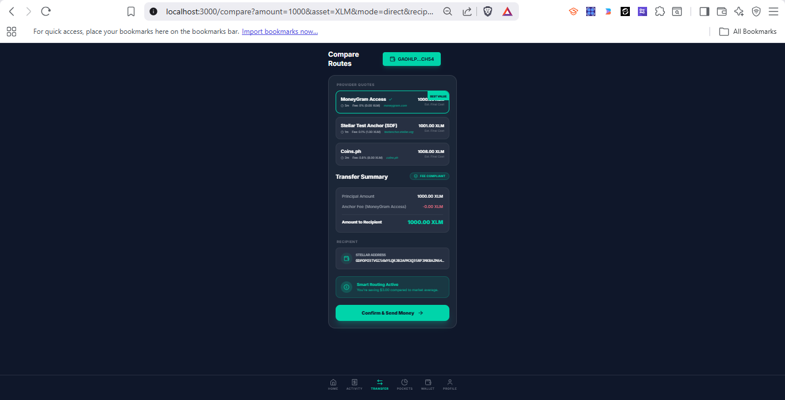
        <p align="center"><small>Real-time anchor comparison to find the best rate.</small></p>
      </td>
    </tr>
    <tr>
      <td width="33%">
        <p align="center"><b>4. Contract Invocation</b></p>
        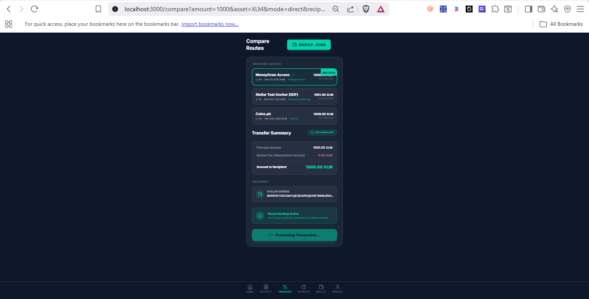
        <p align="center"><small>Building the Soroban transaction for the split logic.</small></p>
      </td>
      <td width="33%">
        <p align="center"><b>5. Secure Signing</b></p>
        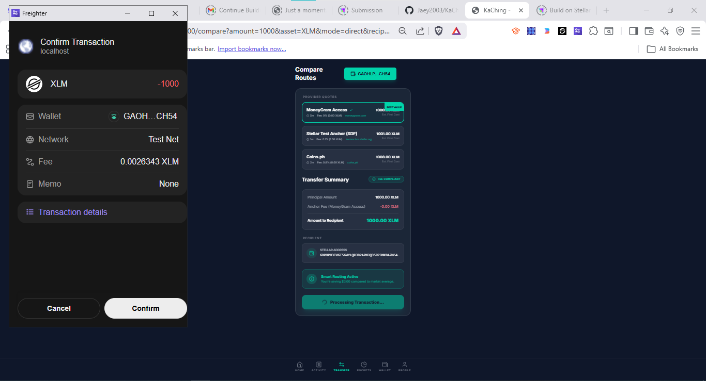
        <p align="center"><small>User authorizes the transfer via Freighter Wallet.</small></p>
      </td>
      <td width="33%">
        <p align="center"><b>6. Confirmation</b></p>
        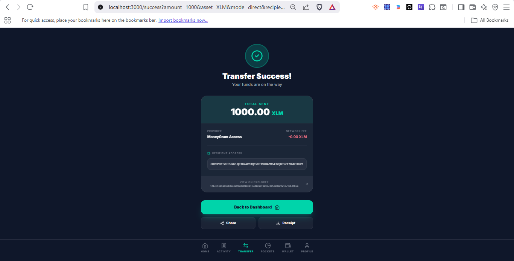
        <p align="center"><small>Success confirmation with explorer links.</small></p>
      </td>
    </tr>
    <tr>
      <td colspan="3">
        <p align="center"><b>7. On-Chain Verification</b></p>
        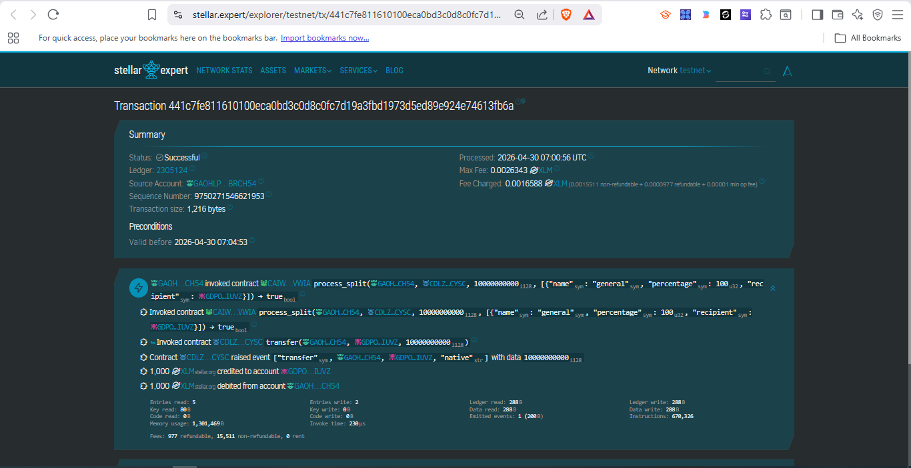
        <p align="center"><small>Verified execution of the <code>process_split</code> function on Stellar Expert.</small></p>
      </td>
    </tr>
  </table>
</div>

## 🌌 Stellar Features Leveraged
- **Soroban Smart Contracts**: Programmatic distribution of funds.
- **Stellar Assets (SAC)**: Interacting with Native (XLM) and Tokenized (USDC) assets.
- **Horizon API**: Fetching account balances and historical transaction data.
- **Atomic Transactions**: Ensuring either all pockets get funded or none do.

---
*Built for the Stellar Soroban Ecosystem.*